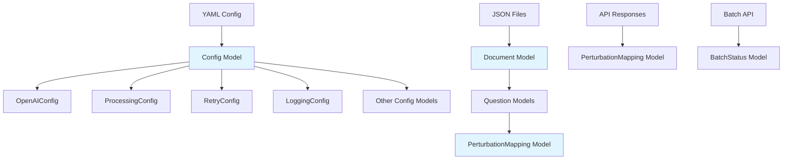

# Pydantic Implementation Plan

## Overview

Replace untyped dictionaries and manual validation with Pydantic models across the codebase. This will provide:

- Type safety and IDE autocomplete
- Automatic structure validation
- Clearer error messages
- Reduced boilerplate code
- Better maintainability

## Architecture




## Implementation Steps

### Phase 1: Setup and Dependencies

1. **Add Pydantic to requirements**

- Add `pydantic>=2.0.0` and `pydantic-settings>=2.0.0` to [requirements.txt](requirements.txt)
- Ensure compatibility with Python 3.8+ (if applicable)

2. **Create models directory structure**

- Create `src/models/` directory
- Create `src/models/__init__.py` with exports
- Organize models into logical modules

### Phase 2: Core Data Models

3. **Create perturbation models** (`src/models/perturbation.py`)

- `PerturbationMapping`: Core model for perturbation data
    - Fields: `question_index`, `latex_stem_text`, `original_substring`, `replacement_substring`, `start_pos`, `end_pos`, `target_wrong_answer`, `reasoning`
    - Basic type validation (int ranges, string lengths)
    - Note: Complex validation (substring existence, length constraints) remains in separate validation functions

4. **Create question models** (`src/models/question.py`)

- `Question`: Question structure
    - Fields: `question_number`, `question_type`, `stem_text`, `options`, `gold_answer`, `perturbations`, `latex_stem_text`
    - Enum for `question_type` (MCQ, TF, LONG)
- `FilePaths`: File path structure
- `Document`: Complete document structure
    - Fields: `docid`, `domain`, `academic_level`, `questions`, `file_paths`

### Phase 3: Configuration Models

5. **Create configuration models** (`src/models/config.py`)

- Replace [src/config.py](src/config.py) Config class with Pydantic models
- Create nested models:
    - `OpenAIConfig`: API settings (model, batch_size, timeout, etc.)
    - `ProcessingConfig`: Processing settings
    - `RetryConfig`: Retry and backoff settings
    - `LoggingConfig`: Logging configuration
    - `BatchAPIConfig`: Batch API settings
    - `InjectionConfig`: Injection method settings
    - `PDFGenerationConfig`: PDF generation settings
    - `PromptConfig`: Prompt customization
    - `PerformanceConfig`: Performance settings
    - `ExperimentalConfig`: Experimental features
    - `PathsConfig`: Path configurations
    - `ValidationConfig`: Validation settings
- `Config`: Main configuration model using `BaseSettings` from pydantic-settings
    - Load from YAML using `model_validate()` with YAML loader
    - Support environment variable overrides via `SettingsConfigDict`
    - Remove all `@property` methods (breaking change - update all call sites)

### Phase 4: API Response Models

6. **Create API models** (`src/models/api.py`)

- `BatchStatus`: Batch API status response
- `BatchRequest`: Batch API request structure
- `APIResponse`: Generic API response wrapper (if needed)

### Phase 5: Migration - Configuration

7. **Update config usage** ([src/config.py](src/config.py))

- Replace `Config` class with Pydantic model
- Update `_load_config()` to use `Config.from_yaml()`
- Update `_load_env_overrides()` to use Pydantic settings
- Remove all property methods

8. **Update config call sites**

- [src/openai_client.py](src/openai_client.py): Update `OpenAIClient.__init__()` to access config attributes directly (e.g., `config.openai.model` instead of `config.openai_model`)
- [src/processor.py](src/processor.py): Update all config property accesses
- [src/pdf_generator.py](src/pdf_generator.py): Update config usage
- [src/batch_retriever.py](src/batch_retriever.py): Update config usage
- Search for all `config.` accesses and update to nested attribute access

### Phase 6: Migration - Data Models

9. **Update file_handler.py** ([src/file_handler.py](src/file_handler.py))

- `load_json_file()`: Return `Document` model instead of `Dict[str, Any]`
- `save_perturbed_json()`: Accept `Document` model
- Update `discover_json_files()` to handle model validation

10. **Update processor.py** ([src/processor.py](src/processor.py))

    - `process_document()`: Use `Document` model instead of dict
    - Update question iteration to use typed models
    - Update perturbation handling to use `PerturbationMapping` models

11. **Update openai_client.py** ([src/openai_client.py](src/openai_client.py))

    - `_call_api_with_retry()`: Parse JSON into `List[PerturbationMapping]`
    - `generate_perturbations()`: Return `Dict[int, List[PerturbationMapping]]`
    - `batch_generate_perturbations()`: Use typed models
    - `parse_batch_results()`: Return typed models
    - `check_batch_status()`: Return `BatchStatus` model
    - Handle validation errors gracefully with try/except around `model_validate()`

12. **Update injection modules** ([src/injection/](src/injection/))

    - `base_injector.py`: Update `inject()` signature to accept `List[PerturbationMapping]` and `List[Question]`
    - `icw_injector.py`: Update to use typed models
    - `dual_layer_injector.py`: Update to use typed models
    - `font_attack_injector.py`: Update to use typed models
    - `hybrid_injectors.py`: Update to use typed models
    - `orchestrator.py`: Update to use typed models

13. **Update pdf_generator.py** ([src/pdf_generator.py](src/pdf_generator.py))

    - `extract_metadata_from_json()`: Use `Document` model
    - Update all JSON loading to use models

### Phase 7: Validation Integration

14. **Create validation module** (`src/validation.py`)

    - Keep existing validation logic separate from Pydantic models
    - Create validation functions that work with Pydantic models:
    - `validate_perturbation_mapping()`: Check substring existence, length constraints, etc.
    - `validate_question()`: Question-specific validation
    - `validate_document()`: Document-level validation
    - These functions accept Pydantic models and return validation results

15. **Update validation usage**

    - Integrate validation functions where needed (processor, injectors)
    - Use Pydantic's `model_validate()` for structure validation
    - Use custom validation functions for business logic

### Phase 8: Error Handling

16. **Add error handling**

    - Handle `ValidationError` from Pydantic throughout codebase
    - Provide meaningful error messages when models fail validation
    - Log validation errors appropriately
    - Graceful fallbacks where appropriate

### Phase 9: Testing and Cleanup

17. **Update type hints**

    - Replace all `Dict[str, Any]` with appropriate model types
    - Replace `List[Dict[str, Any]]` with `List[PerturbationMapping]` etc.
    - Update function signatures throughout codebase

18. **Remove unused code**

    - Remove old validation code if replaced by Pydantic
    - Clean up any dict manipulation code that's now handled by models

19. **Update documentation**

    - Update docstrings to reference Pydantic models
    - Update README if needed

## File Structure

```javascript
src/
├── models/
│   ├── __init__.py          # Export all models
│   ├── config.py            # Configuration models
│   ├── perturbation.py       # Perturbation and question models
│   ├── api.py               # API response models
│   └── enums.py             # Enums (QuestionType, etc.)
├── validation.py            # Validation functions (separate from Pydantic)
├── config.py                # Updated to use Pydantic Config model
└── ... (other files updated)
```


## Key Design Decisions

1. **Validation Strategy**: Use Pydantic for structure validation, keep complex business logic in separate validation functions
2. **Backward Compatibility**: Break interface and update all call sites (cleaner approach)
3. **Error Handling**: Catch `ValidationError` and provide meaningful messages
4. **Type Safety**: Replace all `Dict[str, Any]` with typed models
5. **Configuration**: Use `pydantic-settings` for environment variable support

## Migration Order

1. Models first (no dependencies)
2. Configuration (used everywhere)
3. Data models (used in processing)
4. API models (used in client)
5. Update all call sites
6. Add validation integration
7. Cleanup and testing

## Benefits

- Type safety throughout codebase
- Automatic structure validation
- Better IDE support and autocomplete
- Clearer error messages
- Reduced boilerplate (no manual property methods)